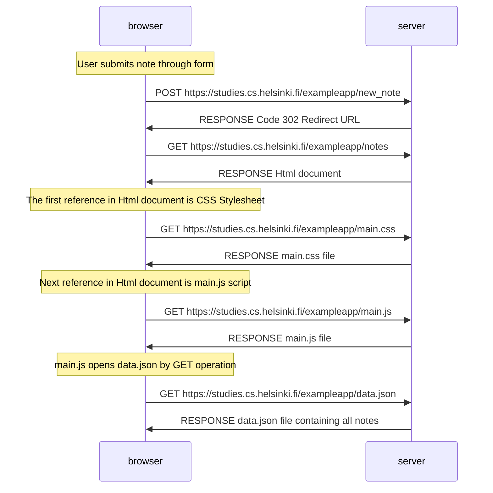

```mermaid
sequenceDiagram
    participant browser
    participant server

    Note over browser: User submits note through form
    browser->>server: POST https://studies.cs.helsinki.fi/exampleapp/new_note
    server->>browser: RESPONSE Code 302 Redirect URL

    browser->>server: GET https://studies.cs.helsinki.fi/exampleapp/notes
    server->>browser: RESPONSE Html document

    Note over browser: The first reference in Html document is CSS Stylesheet

    browser->>server: GET https://studies.cs.helsinki.fi/exampleapp/main.css
    server->>browser: RESPONSE main.css file

    Note over browser: Next reference in Html document is main.js script

    browser->>server: GET https://studies.cs.helsinki.fi/exampleapp/main.js
    server->>browser: RESPONSE main.js file

    Note over browser: main.js opens data.json by GET operation

    browser->>server: GET https://studies.cs.helsinki.fi/exampleapp/data.json
    server->>browser: RESPONSE data.json file containing all notes
```