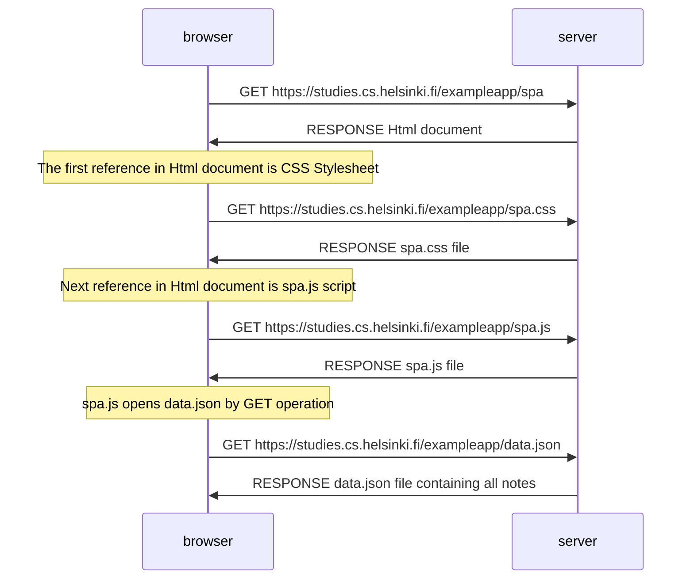

```mermaid
sequenceDiagram
    participant browser
    participant server

    browser->>server: GET https://studies.cs.helsinki.fi/exampleapp/spa
    server->>browser: RESPONSE Html document

    Note over browser: The first reference in Html document is CSS Stylesheet

    browser->>server: GET https://studies.cs.helsinki.fi/exampleapp/spa.css
    server->>browser: RESPONSE spa.css file

    Note over browser: Next reference in Html document is spa.js script

    browser->>server: GET https://studies.cs.helsinki.fi/exampleapp/spa.js
    server->>browser: RESPONSE spa.js file

    Note over browser: spa.js opens data.json by GET operation

    browser->>server: GET https://studies.cs.helsinki.fi/exampleapp/data.json
    server->>browser: RESPONSE data.json file containing all notes
```