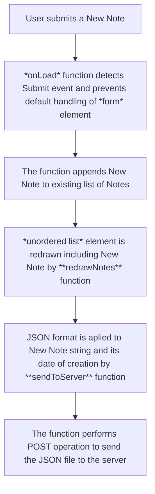

```mermaid
flowchart

    Step1["User submits a New Note"]
    Step2[" *onLoad* function detects Submit event and prevents default handling of *form* element"]
    Step3["The function appends New Note to existing list of Notes"]
    Step4[" *unordered list* element is redrawn including New Note by **redrawNotes** function"]
    Step5["JSON format is aplied to New Note string and its date of creation by **sendToServer** function"]
    Step6["The function performs POST operation to send the JSON file to the server"]

    Step1-->Step2-->Step3-->Step4-->Step5-->Step6

```